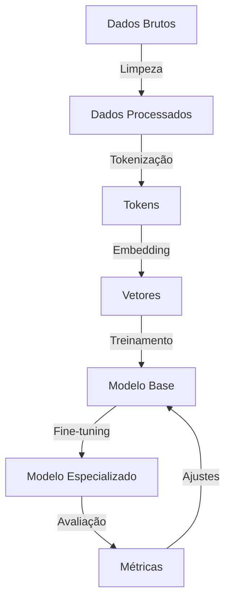

# Fluxo de Treinamento

O processo de treinamento de um agente de IA envolve várias etapas, desde a preparação dos dados até a avaliação e ajuste fino do modelo.

## Visão Geral do Processo



### Preparação dos Dados

A preparação de uma base de conhecimento para sistemas RAG envolve várias etapas para otimizar a recuperação e utilização de informações.

### 1. Coleta de Documentos
A primeira etapa é reunir os documentos que formarão sua base de conhecimento.

```typescript
interface DocumentSource {
  content: string;
  metadata: {
    source: string;
    author?: string;
    created?: Date;
    format: 'pdf' | 'txt' | 'html' | 'docx';
    url?: string;
  }
}

async function collectDocuments(): Promise<DocumentSource[]> {
  const documents: DocumentSource[] = [];
  
  // Exemplo: coletando de diferentes fontes
  const pdfDocs = await collectFromPDFs('./resources/pdfs');
  const webDocs = await scrapeWebsites(['https://example.com/docs']);
  const apiDocs = await fetchFromAPI('https://api.company.com/documentation');
  
  return [...pdfDocs, ...webDocs, ...apiDocs];
}
```

### 2. Processamento de Documentos
Conversão de diferentes formatos para texto simples.

```typescript
async function processDocuments(sources: DocumentSource[]): Promise<ProcessedDocument[]> {
  const processed: ProcessedDocument[] = [];
  
  for (const source of sources) {
    let textContent: string;
    
    switch (source.metadata.format) {
      case 'pdf':
        textContent = await extractTextFromPDF(source.content);
        break;
      case 'html':
        textContent = extractTextFromHTML(source.content);
        break;
      case 'docx':
        textContent = await extractTextFromDOCX(source.content);
        break;
      default:
        textContent = source.content;
    }
    
    processed.push({
      content: textContent,
      metadata: source.metadata
    });
  }
  
  return processed;
}
```

### 3. Segmentação (Chunking)
Divisão dos documentos em segmentos menores e gerenciáveis.

```typescript
interface TextChunk {
  content: string;
  metadata: {
    source: string;
    chunkIndex: number;
    totalChunks: number;
    // metadata herdada do documento original
  }
}

function chunkDocument(doc: ProcessedDocument): TextChunk[] {
  const chunks: TextChunk[] = [];
  
  // Estratégia 1: Chunks por tamanho fixo (tokens/caracteres)
  const textChunks = splitIntoChunks(doc.content, 500); // ~500 tokens
  
  // Estratégia 2: Chunks por parágrafo
  // const textChunks = splitByParagraphs(doc.content);
  
  // Estratégia 3: Chunks por seções semânticas
  // const textChunks = splitBySections(doc.content);
  
  textChunks.forEach((chunk, index) => {
    chunks.push({
      content: chunk,
      metadata: {
        ...doc.metadata,
        chunkIndex: index,
        totalChunks: textChunks.length
      }
    });
  });
  
  return chunks;
}
```

### 4. Limpeza de Texto
Remoção de elementos indesejados e normalização.

```typescript
function cleanText(chunk: TextChunk): TextChunk {
  let cleanedContent = chunk.content;
  
  // Remover caracteres especiais
  cleanedContent = cleanedContent.replace(/[^\w\s.,?!:;()\[\]{}"']/g, ' ');
  
  // Remover espaços extras
  cleanedContent = cleanedContent.replace(/\s+/g, ' ').trim();
  
  // Normalizar quebras de linha
  cleanedContent = cleanedContent.replace(/\n+/g, '\n');
  
  return {
    ...chunk,
    content: cleanedContent
  };
}
```

### 5. Extração de Metadata
Enriquecimento com informações adicionais.

```typescript
async function extractMetadata(chunk: TextChunk): Promise<TextChunk> {
  // Extrair entidades
  const entities = await extractNamedEntities(chunk.content);
  
  // Classificar tópico
  const topics = await classifyTopics(chunk.content);
  
  // Determinar importância
  const importance = calculateImportanceScore(chunk.content);
  
  return {
    ...chunk,
    metadata: {
      ...chunk.metadata,
      entities,
      topics,
      importance
    }
  };
}
```

### 6. Geração de Embeddings
Transformação de texto em vetores.

```typescript
async function generateEmbeddings(chunks: TextChunk[]): Promise<EmbeddedChunk[]> {
  const embeddingModel = new OpenAIEmbeddings();
  const embeddedChunks: EmbeddedChunk[] = [];
  
  // Processamento em batches
  for (let i = 0; i < chunks.length; i += 20) {
    const batch = chunks.slice(i, i + 20);
    const texts = batch.map(chunk => chunk.content);
    
    // Gerar embeddings em batch
    const embeddings = await embeddingModel.embedDocuments(texts);
    
    // Combinar chunks com seus embeddings
    batch.forEach((chunk, index) => {
      embeddedChunks.push({
        ...chunk,
        embedding: embeddings[index]
      });
    });
    
    // Throttling para respeitar limites de API
    if (i + 20 < chunks.length) {
      await new Promise(r => setTimeout(r, 200));
    }
  }
  
  return embeddedChunks;
}
```

### 7. Armazenamento em Banco Vetorial
Persistência dos vetores para recuperação.

```typescript
async function storeInVectorDB(chunks: EmbeddedChunk[]): Promise<void> {
  const db = await getVectorDBClient();
  const collection = db.collection('knowledge_base');
  
  // Inserir em batches
  for (let i = 0; i < chunks.length; i += 100) {
    const batch = chunks.slice(i, i + 100);
    
    await collection.insertMany(batch.map(chunk => ({
      content: chunk.content,
      embedding: chunk.embedding,
      metadata: chunk.metadata
    })));
  }
  
  console.log(`Stored ${chunks.length} chunks in vector database`);
}
```

### 8. Indexação e Otimização
Criação de índices para busca eficiente.

```typescript
async function optimizeVectorDB(): Promise<void> {
  const db = await getVectorDBClient();
  const collection = db.collection('knowledge_base');
  
  // Criar índice vetorial
  await collection.createIndex(
    { embedding: "vector" },
    {
      name: "vector_index",
      vectorSize: 1536,
      vectorSearchOptions: {
        similarity: "cosine"
      }
    }
  );
  
  // Criar índices adicionais para filtragem
  await collection.createIndex({ "metadata.topics": 1 });
  await collection.createIndex({ "metadata.importance": -1 });
  await collection.createIndex({ "metadata.source": 1 });
}
```

### 9. Avaliação e Refinamento
Testes para garantir recuperação eficaz.

```typescript
async function evaluateRetrieval(): Promise<void> {
  const testQueries = [
    "Como configurar autenticação dois fatores?",
    "Qual é a política de reembolso?",
    "Quais são os requisitos mínimos de sistema?"
  ];
  
  const vectorDB = await getVectorDBClient();
  
  let totalRelevance = 0;
  let totalPrecision = 0;
  
  for (const query of testQueries) {
    const results = await vectorDB.similaritySearch(query, 5);
    
    // Avaliar manualmente ou com modelo de avaliação
    const relevanceScore = await evaluateRelevance(query, results);
    totalRelevance += relevanceScore;
    
    // Calcular precisão
    const precision = await calculatePrecision(query, results);
    totalPrecision += precision;
    
    console.log(`Query: "${query}"`);
    console.log(`- Relevance: ${relevanceScore.toFixed(2)}`);
    console.log(`- Precision: ${precision.toFixed(2)}`);
  }
  
  console.log(`Average Relevance: ${(totalRelevance / testQueries.length).toFixed(2)}`);
  console.log(`Average Precision: ${(totalPrecision / testQueries.length).toFixed(2)}`);
}
```

### Fluxo Completo

```typescript
async function fullTrainingFlow() {
  // 1. Coleta
  const documents = await collectDocuments();
  console.log(`Collected ${documents.length} documents`);
  
  // 2. Processamento
  const processed = await processDocuments(documents);
  
  // 3. Chunking
  const chunks = processed.flatMap(doc => chunkDocument(doc));
  console.log(`Created ${chunks.length} chunks`);
  
  // 4. Limpeza
  const cleanedChunks = chunks.map(chunk => cleanText(chunk));
  
  // 5. Metadata
  const enrichedChunks = await Promise.all(
    cleanedChunks.map(chunk => extractMetadata(chunk))
  );
  
  // 6. Embeddings
  const embeddedChunks = await generateEmbeddings(enrichedChunks);
  
  // 7. Armazenamento
  await storeInVectorDB(embeddedChunks);
  
  // 8. Otimização
  await optimizeVectorDB();
  
  // 9. Avaliação
  await evaluateRetrieval();
  
  console.log("Knowledge base training completed!");
}
```

A qualidade da sua base de conhecimento depende diretamente da qualidade deste processo. Vale a pena investir tempo em cada etapa para garantir resultados ótimos. 