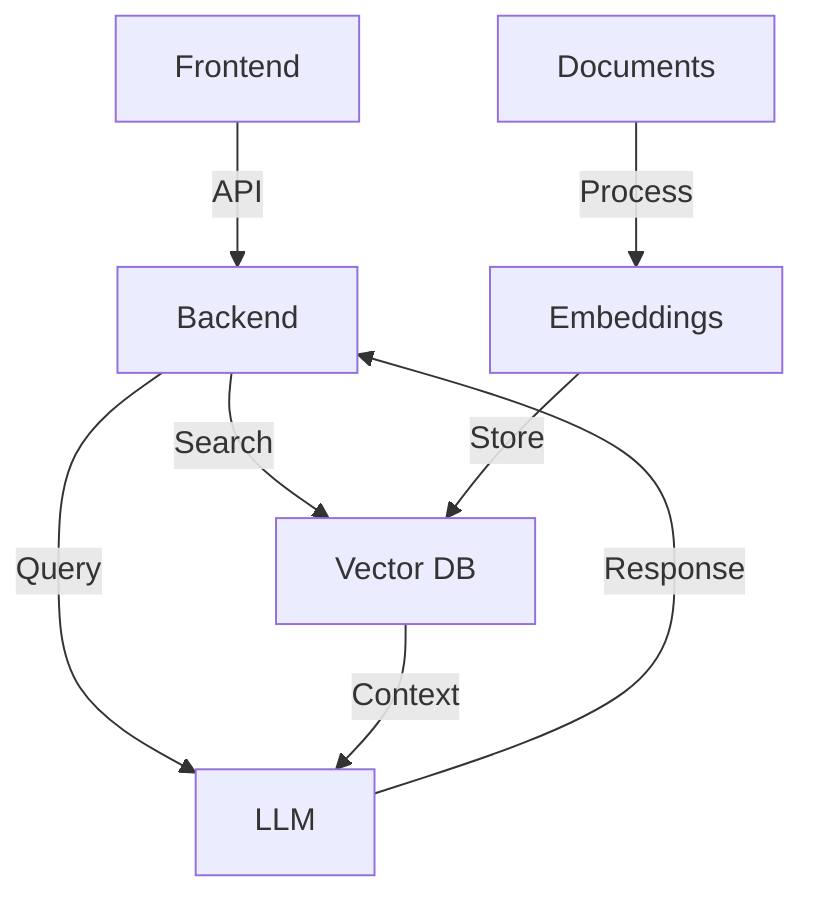

# Tutorial: Construindo uma Aplicação RAG

Este tutorial mostra como construir uma aplicação RAG (Retrieval Augmented Generation) do zero.

## Arquitetura



## Pré-requisitos

- Node.js (v16+) e npm/yarn
- MongoDB Atlas com Vector Search habilitado
- Conta OpenAI ou outro provedor de LLM
- Redis (opcional, para chat memory)

## Etapa 1: Configuração Inicial

Começamos criando o projeto e instalando as dependências necessárias.

```bash
# Criar diretório do projeto
mkdir rag-app
cd rag-app

# Inicializar projeto
npm init -y

# Instalar dependências
npm install express mongodb openai redis dotenv cors
npm install typescript ts-node @types/node @types/express @types/cors --save-dev

# Inicializar TypeScript
npx tsc --init
```

Configurar arquivo `.env`:

```
# API Keys e Conexões
OPENAI_API_KEY=sk-...
MONGODB_URI=mongodb+srv://...
REDIS_URL=redis://...

# Configurações de Aplicação
PORT=3000
VECTOR_DIMENSION=1536
```

## Etapa 2: Estrutura do Projeto
Organizar os arquivos do projeto:

```bash
mkdir -p src/{config,models,services,controllers,routes,utils}
```

```
src/
├── config/         # Configurações da aplicação
├── models/         # Interfaces e tipos
├── services/       # Lógica de negócio
├── controllers/    # Handlers de requisição
├── routes/         # Definição de rotas
├── utils/          # Utilitários
└── index.ts        # Ponto de entrada
```

## Etapa 3: Configuração de Conexões
Criar arquivo de configuração para conexões externas:

```ts
// src/config/database.ts
import { MongoClient } from 'mongodb';
import dotenv from 'dotenv';

dotenv.config();

const uri = process.env.MONGODB_URI;
const client = new MongoClient(uri);

export async function connectToDatabase() {
  try {
    await client.connect();
    console.log("Connected to MongoDB");
    return client.db("rag_database");
  } catch (error) {
    console.error("Failed to connect to MongoDB:", error);
    process.exit(1);
  }
}

// src/config/openai.ts
import { OpenAI } from "openai";
import dotenv from 'dotenv';

dotenv.config();

export const openai = new OpenAI({
  apiKey: process.env.OPENAI_API_KEY,
});

// src/config/redis.ts
import { createClient } from 'redis';
import dotenv from 'dotenv';

dotenv.config();

export async function connectToRedis() {
  const client = createClient({
    url: process.env.REDIS_URL
  });

  client.on('error', (err) => {
    console.error('Redis error:', err);
  });

  await client.connect();
  console.log('Connected to Redis');
  
  return client;
}
```

## Etapa 4: Definindo Modelos
Criar os tipos e interfaces necessários:

```ts
// src/models/document.ts
export interface Document {
  content: string;
  metadata: {
    source: string;
    author?: string;
    created?: Date;
    title?: string;
    category?: string;
    [key: string]: any;
  };
}

export interface EmbeddedDocument extends Document {
  embedding: number[];
}

// src/models/chat.ts
export interface ChatMessage {
  role: 'user' | 'assistant' | 'system';
  content: string;
  timestamp?: Date;
}

// src/models/query.ts
export interface QueryResult {
  answer: string;
  sources: {
    content: string;
    metadata: any;
    score: number;
  }[];
}
```

## Etapa 5: Implementando Serviços
Criando os serviços principais:

```ts
// src/services/embeddingService.ts
import { openai } from '../config/openai';
import { Document, EmbeddedDocument } from '../models/document';

export async function generateEmbedding(text: string): Promise<number[]> {
  const response = await openai.embeddings.create({
    model: "text-embedding-ada-002",
    input: text,
  });
  
  return response.data[0].embedding;
}

export async function embedDocument(doc: Document): Promise<EmbeddedDocument> {
  const embedding = await generateEmbedding(doc.content);
  
  return {
    ...doc,
    embedding
  };
}

// src/services/vectorStoreService.ts
import { Db, Collection } from 'mongodb';
import { EmbeddedDocument, Document } from '../models/document';
import { generateEmbedding } from './embeddingService';

export class VectorStore {
  private collection: Collection;
  
  constructor(db: Db) {
    this.collection = db.collection('documents');
  }
  
  async initialize() {
    // Verificar se o índice existe
    const indexes = await this.collection.listIndexes().toArray();
    const hasVectorIndex = indexes.some(idx => idx.name === 'vector_index');
    
    if (!hasVectorIndex) {
      console.log('Creating vector index...');
      await this.collection.createIndex(
        { embedding: "vector" },
        {
          name: "vector_index",
          vectorSize: parseInt(process.env.VECTOR_DIMENSION || "1536"),
          vectorSearchOptions: { similarity: "cosine" }
        }
      );
    }
  }
  
  async addDocument(doc: Document): Promise<void> {
    const embedding = await generateEmbedding(doc.content);
    
    await this.collection.insertOne({
      content: doc.content,
      metadata: doc.metadata,
      embedding,
      created_at: new Date()
    });
  }
  
  async addDocuments(docs: Document[]): Promise<void> {
    const embedded = await Promise.all(
      docs.map(async (doc) => {
        const embedding = await generateEmbedding(doc.content);
        return {
          content: doc.content,
          metadata: doc.metadata,
          embedding,
          created_at: new Date()
        };
      })
    );
    
    if (embedded.length > 0) {
      await this.collection.insertMany(embedded);
    }
  }
  
  async search(query: string, limit = 5): Promise<any[]> {
    const embedding = await generateEmbedding(query);
    
    return await this.collection.aggregate([
      {
        $vectorSearch: {
          queryVector: embedding,
          path: "embedding",
          numCandidates: 100,
          limit
        }
      },
      {
        $project: {
          _id: 0,
          content: 1,
          metadata: 1,
          score: { $meta: "vectorSearchScore" }
        }
      }
    ]).toArray();
  }
}

// src/services/chatMemoryService.ts
import { RedisClientType } from 'redis';
import { ChatMessage } from '../models/chat';

export class ChatMemory {
  private prefix: string = 'chat:';
  
  constructor(private redis: RedisClientType) {}
  
  async addMessage(sessionId: string, message: ChatMessage): Promise<void> {
    const key = `${this.prefix}${sessionId}`;
    
    // Adicionar timestamp se não existir
    const messageWithTime: ChatMessage = {
      ...message,
      timestamp: message.timestamp || new Date()
    };
    
    await this.redis.rPush(key, JSON.stringify(messageWithTime));
    await this.redis.expire(key, 24 * 60 * 60); // 24h TTL
  }
  
  async getMessages(sessionId: string): Promise<ChatMessage[]> {
    const key = `${this.prefix}${sessionId}`;
    const messages = await this.redis.lRange(key, 0, -1);
    
    return messages.map(m => JSON.parse(m));
  }
  
  async clearSession(sessionId: string): Promise<void> {
    const key = `${this.prefix}${sessionId}`;
    await this.redis.del(key);
  }
}

// src/services/ragService.ts
import { VectorStore } from './vectorStoreService';
import { ChatMemory } from './chatMemoryService';
import { openai } from '../config/openai';
import { QueryResult } from '../models/query';
import { ChatMessage } from '../models/chat';

export class RAGService {
  constructor(
    private vectorStore: VectorStore,
    private chatMemory: ChatMemory,
    private systemPrompt: string = "You are a helpful assistant."
  ) {}
  
  async query(question: string, sessionId: string): Promise<QueryResult> {
    // 1. Buscar documentos relevantes
    const relevantDocs = await this.vectorStore.search(question, 3);
    
    // 2. Obter histórico da conversa
    const chatHistory = await this.chatMemory.getMessages(sessionId);
    
    // 3. Construir mensagens para o LLM
    const messages = this.buildMessages(question, chatHistory, relevantDocs);
    
    // 4. Gerar resposta
    const completion = await openai.chat.completions.create({
      model: "gpt-3.5-turbo",
      messages,
    });
    
    const answer = completion.choices[0].message.content;
    
    // 5. Salvar na memória
    await this.chatMemory.addMessage(sessionId, { role: 'user', content: question });
    await this.chatMemory.addMessage(sessionId, { role: 'assistant', content: answer });
    
    return {
      answer,
      sources: relevantDocs
    };
  }
  
  private buildMessages(question: string, history: ChatMessage[], docs: any[]) {
    // Construir contexto dos documentos
    const context = docs.map(doc => doc.content).join('\n\n');
    
    // Mensagens iniciais com prompt do sistema
    const messages = [
      {
        role: 'system',
        content: `${this.systemPrompt}\n\nWhen answering, use the following context:\n${context}`
      }
    ];
    
    // Adicionar histórico limitado (últimas 6 mensagens)
    const recentHistory = history.slice(-6);
    messages.push(...recentHistory.map(m => ({
      role: m.role,
      content: m.content
    })));
    
    // Adicionar pergunta atual
    messages.push({
      role: 'user',
      content: question
    });
    
    return messages;
  }
}
```

## Etapa 6: Criando Controladores
Criando os controladores para as APIs:

```ts
// src/controllers/documentController.ts
import { Request, Response } from 'express';
import { VectorStore } from '../services/vectorStoreService';

export class DocumentController {
  constructor(private vectorStore: VectorStore) {}
  
  async addDocument(req: Request, res: Response) {
    try {
      const { content, metadata } = req.body;
      
      if (!content) {
        return res.status(400).json({ error: 'Content is required' });
      }
      
      await this.vectorStore.addDocument({
        content,
        metadata: metadata || {}
      });
      
      res.status(201).json({ success: true, message: 'Document added successfully' });
    } catch (error) {
      console.error('Error adding document:', error);
      res.status(500).json({ error: 'Failed to add document' });
    }
  }
  
  async addDocuments(req: Request, res: Response) {
    try {
      const { documents } = req.body;
      
      if (!Array.isArray(documents) || documents.length === 0) {
        return res.status(400).json({ error: 'Documents array is required' });
      }
      
      await this.vectorStore.addDocuments(documents);
      
      res.status(201).json({ 
        success: true, 
        message: `${documents.length} documents added successfully`
      });
    } catch (error) {
      console.error('Error adding documents:', error);
      res.status(500).json({ error: 'Failed to add documents' });
    }
  }
}

// src/controllers/queryController.ts
import { Request, Response } from 'express';
import { RAGService } from '../services/ragService';
import { v4 as uuidv4 } from 'uuid';

export class QueryController {
  constructor(private ragService: RAGService) {}
  
  async query(req: Request, res: Response) {
    try {
      const { question, sessionId } = req.body;
      
      if (!question) {
        return res.status(400).json({ error: 'Question is required' });
      }
      
      // Usar sessionId fornecido ou gerar um novo
      const chatSessionId = sessionId || uuidv4();
      
      const result = await this.ragService.query(question, chatSessionId);
      
      res.json({
        ...result,
        sessionId: chatSessionId
      });
    } catch (error) {
      console.error('Error processing query:', error);
      res.status(500).json({ error: 'Failed to process query' });
    }
  }
}
```

## Etapa 7: Configurando Rotas
Definindo as rotas da API:

```ts
// src/routes/documentRoutes.ts
import { Router } from 'express';
import { DocumentController } from '../controllers/documentController';
import { VectorStore } from '../services/vectorStoreService';

export function createDocumentRouter(vectorStore: VectorStore): Router {
  const router = Router();
  const controller = new DocumentController(vectorStore);
  
  router.post('/', (req, res) => controller.addDocument(req, res));
  router.post('/batch', (req, res) => controller.addDocuments(req, res));
  
  return router;
}

// src/routes/queryRoutes.ts
import { Router } from 'express';
import { QueryController } from '../controllers/queryController';
import { RAGService } from '../services/ragService';

export function createQueryRouter(ragService: RAGService): Router {
  const router = Router();
  const controller = new QueryController(ragService);
  
  router.post('/', (req, res) => controller.query(req, res));
  
  return router;
}
```

## Etapa 8: Configurando o App Principal
Criando o arquivo principal:

```ts
// src/index.ts
import express from 'express';
import cors from 'cors';
import dotenv from 'dotenv';
import { connectToDatabase } from './config/database';
import { connectToRedis } from './config/redis';
import { VectorStore } from './services/vectorStoreService';
import { ChatMemory } from './services/chatMemoryService';
import { RAGService } from './services/ragService';
import { createDocumentRouter } from './routes/documentRoutes';
import { createQueryRouter } from './routes/queryRoutes';

dotenv.config();

const PORT = process.env.PORT || 3000;

async function startServer() {
  const app = express();
  
  // Middlewares
  app.use(cors());
  app.use(express.json());
  
  // Conexões
  const db = await connectToDatabase();
  const redis = await connectToRedis();
  
  // Serviços
  const vectorStore = new VectorStore(db);
  await vectorStore.initialize();
  
  const chatMemory = new ChatMemory(redis);
  
  const systemPrompt = `
    You are a helpful assistant that answers questions based on the provided context.
    If the answer is not in the context, say that you don't know.
    Always be polite, concise, and helpful.
  `;
  
  const ragService = new RAGService(vectorStore, chatMemory, systemPrompt);
  
  // Rotas
  app.use('/api/documents', createDocumentRouter(vectorStore));
  app.use('/api/query', createQueryRouter(ragService));
  
  // Rota de saúde
  app.get('/health', (req, res) => {
    res.json({ status: 'ok', timestamp: new Date() });
  });
  
  // Iniciar servidor
  app.listen(PORT, () => {
    console.log(`Server running on port ${PORT}`);
  });
}

startServer().catch(console.error);
```

## Etapa 9: Scripts Para Execução
Atualizar o `package.json` com scripts:

```json
"scripts": {
  "build": "tsc",
  "start": "node dist/index.js",
  "dev": "ts-node src/index.ts",
  "seed": "ts-node scripts/seedDatabase.ts"
}
```

## Etapa 10: Adicionar Script de Importação
Criar arquivo para importar documentos:

```ts
// scripts/seedDatabase.ts
import { connectToDatabase } from '../src/config/database';
import { VectorStore } from '../src/services/vectorStoreService';
import fs from 'fs/promises';
import path from 'path';

async function seedDatabase() {
  try {
    console.log('Connecting to database...');
    const db = await connectToDatabase();
    
    console.log('Initializing vector store...');
    const vectorStore = new VectorStore(db);
    await vectorStore.initialize();
    
    console.log('Reading sample data...');
    const dataPath = path.join(__dirname, 'data', 'sample-docs.json');
    const data = await fs.readFile(dataPath, 'utf-8');
    const documents = JSON.parse(data);
    
    console.log(`Importing ${documents.length} documents...`);
    await vectorStore.addDocuments(documents);
    
    console.log('Import completed successfully!');
    process.exit(0);
  } catch (error) {
    console.error('Error seeding database:', error);
    process.exit(1);
  }
}

seedDatabase();
```

## Testando a Aplicação

```bash
# Iniciar o servidor
npm run dev

# Em outro terminal, adicionar um documento
curl -X POST http://localhost:3000/api/documents \
  -H "Content-Type: application/json" \
  -d '{"content": "MongoDB Atlas is a fully-managed cloud database service for modern applications.", "metadata": {"source": "manual-entry", "category": "database"}}'

# Fazer uma consulta
curl -X POST http://localhost:3000/api/query \
  -H "Content-Type: application/json" \
  -d '{"question": "What is MongoDB Atlas?", "sessionId": "test-session"}'
```

## Próximos Passos
Para expandir a aplicação:
1. Adicionar autenticação
2. Implementar frontend
3. Adicionar monitoramento
4. Melhorar manejo de erros
5. Adicionar testes

Este tutorial mostrou como construir uma aplicação RAG completa, conectando todos os componentes que discutimos anteriormente. 